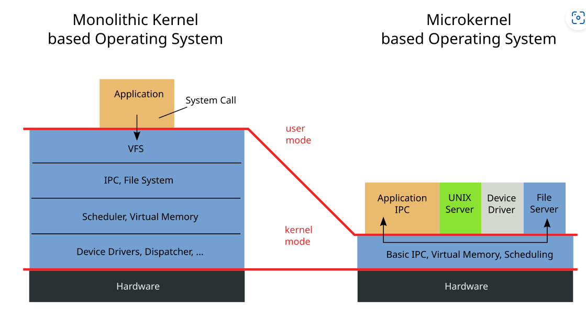

### 什么是操作系统？

in other words, we can say that the OS is an interface between the user and computer hardware.

业界的内核有很多，但无论是什么内核，基本上有几个最重要的组成单元是每个内核均要具备的，分别是：负责持久化数据，并让应用程序能够方便的访问持久化数据的“文件系统”。负责管理进程地址空间的“内存管理”。负责管理多个进程的“进程管理”或者“任务管理“。负责本机操作系统和另外一个设备上操作系统通信的“网络”。

### 什么是宏内核？微内核？区别？优缺点？

#### 宏内核（Monolithic Kernel）：

整个Operating System都运行在内核态。把所有系统服务都放到内核里，因为系统服务代码之间存在大量数据交换和大量的服务请求，而在同一个代码段内进行函数调用 (C 语言) 或跳转 (汇编或者机器码时代) 是最直接、最高效的方法，在同一片地址空间也方便数据交换，所以这样的宏内核设计是很自然的。

Monolithic architecture kernel examples: [Unix](https://en.wikipedia.org/wiki/Unix) (including [Linux](https://en.wikipedia.org/wiki/Linux_kernel)), [MS-DOS](https://en.wikipedia.org/wiki/MS-DOS), [Windows 9x](https://en.wikipedia.org/wiki/Windows_9x).

微内核（Micoro Kernel）：

微内核设计的基本思想是简化内核功能，在内核之外的用户态尽可能多地实现系统服务，同时加入相互之间的安全保护。内核只提供最基础的服务，比如多进程调度、多进程通信（IPC) 等。其中进程通信是作为连接应用与用户态系统服务的桥梁。

Kernel只是作为请求的中继站。

## 微内核的优缺点

### 优点

1. 系统服务模块化，可移植性高；
2. 内核安全性提高 (模块内部的 bug 不影响内核稳定，将黑客利用软件漏洞造成的破坏限制在单个模块内部)；
3. 可以多套系统服务共存，相当于同时运行多种操作系统；
4. 稳定统一的接口 (可以独立维护私有驱动以及服务，不需要跟内核源码绑定)；
5. 在商业上，微内核可以避免代码受到一些开源协议的影响，比如 GPL 协议；
6. 内核精简，可以进行形式化验证，利用数学证明内核的安全性；
7. 数学可证明的实时性；
8. 非常适合多处理器系统设计，在多处理器核心计算机上，互相依赖的系统服务可以同时运行；

### 缺点

1. 通过进程通信的方式交换数据或者调用系统服务，而不是使用系统调用，造成额外的操作系统开销；
2. 使用一些频繁使用的系统服务时，比如网络收发数据，造成的进程上下文切换对操作系统来说也是一个负担；
3. 由于系统服务高度模块化，系统服务之间存在大量的内存复制；
4. 对互相之间存在复杂调用关系的系统服务，难以设计通信接口；
5. 系统服务与内核在地址空间上分离，造成代码局部性差，降低了 cache 命中率；

Reference:

- [华为“鸿蒙”所涉及的微内核到底是什么？一文带你认识微内核_5G/IoT_RTThread物联网操作系统_InfoQ精选文章](https://www.infoq.cn/article/tkax5wwpfb_wosjxcaje)
- [Linux内核 vs Windows内核，你就知道内核架构类型了-linux内核和windows内核 (51cto.com)](https://www.51cto.com/article/647093.html)

- https://zhuanlan.zhihu.com/p/669269017

