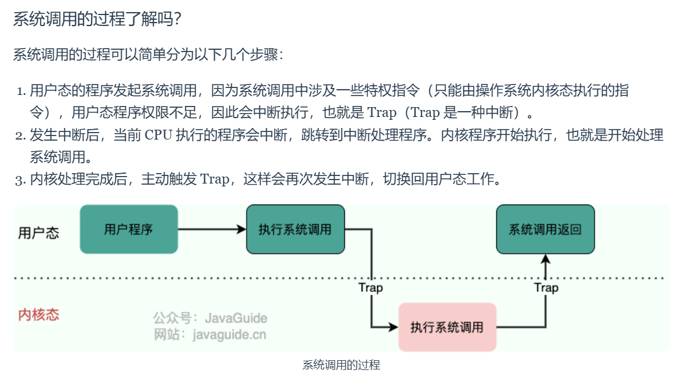

## 什么是操作系统？

in other words, we can say that the OS is an interface between the user and computer hardware.

业界的内核有很多，但无论是什么内核，基本上有几个最重要的组成单元是每个内核均要具备的，分别是：负责持久化数据，并让应用程序能够方便的访问持久化数据的“文件系统”。负责管理进程地址空间的“内存管理”。负责管理多个进程的“进程管理”或者“任务管理“。负责本机操作系统和另外一个设备上操作系统通信的“网络”。

***

## 什么是宏内核？微内核？区别？优缺点？

#### 宏内核（Monolithic Kernel）：

整个Operating System都运行在内核态。把所有系统服务都放到内核里，因为系统服务代码之间存在大量数据交换和大量的服务请求，而在同一个代码段内进行函数调用 (C 语言) 或跳转 (汇编或者机器码时代) 是最直接、最高效的方法，在同一片地址空间也方便数据交换，所以这样的宏内核设计是很自然的。

Monolithic architecture kernel examples: [Unix](https://en.wikipedia.org/wiki/Unix) (including [Linux](https://en.wikipedia.org/wiki/Linux_kernel)), [MS-DOS](https://en.wikipedia.org/wiki/MS-DOS), [Windows 9x](https://en.wikipedia.org/wiki/Windows_9x).

微内核（Micoro Kernel）：

微内核设计的基本思想是简化内核功能，在内核之外的用户态尽可能多地实现系统服务，同时加入相互之间的安全保护。内核只提供最基础的服务，比如多进程调度、多进程通信（IPC) 等。其中进程通信是作为连接应用与用户态系统服务的桥梁。

Kernel只是作为请求的中继站。

### 微内核的优缺点

#### 优点

1. 系统服务模块化，可移植性高；
2. 内核安全性提高 (模块内部的 bug 不影响内核稳定，将黑客利用软件漏洞造成的破坏限制在单个模块内部)；
3. 可以多套系统服务共存，相当于同时运行多种操作系统；
4. 稳定统一的接口 (可以独立维护私有驱动以及服务，不需要跟内核源码绑定)；
5. 在商业上，微内核可以避免代码受到一些开源协议的影响，比如 GPL 协议；
6. 内核精简，可以进行形式化验证，利用数学证明内核的安全性；
7. 数学可证明的实时性；
8. 非常适合多处理器系统设计，在多处理器核心计算机上，互相依赖的系统服务可以同时运行；

#### 缺点

1. 通过进程通信的方式交换数据或者调用系统服务，而不是使用系统调用，造成额外的操作系统开销；
2. 使用一些频繁使用的系统服务时，比如网络收发数据，造成的进程上下文切换对操作系统来说也是一个负担；
3. 由于系统服务高度模块化，系统服务之间存在大量的内存复制；
4. 对互相之间存在复杂调用关系的系统服务，难以设计通信接口；
5. 系统服务与内核在地址空间上分离，造成代码局部性差，降低了 cache 命中率；

***

## 什么是用户态？什么是内核态？

根据进程访问资源的特点，我们可以把进程在系统上的运行分为两个级别：

- **用户态(User Mode)** : 用户态运行的进程可以直接读取用户程序的数据，拥有较低的权限。当应用程序需要执行某些需要特殊权限的操作，例如读写磁盘、网络通信等，就需要向操作系统发起系统调用请求，进入内核态。
- **内核态(Kernel Mode)**：内核态运行的进程几乎可以访问计算机的任何资源包括系统的内存空间、设备、驱动程序等，不受限制，拥有非常高的权限。当操作系统接收到进程的系统调用请求时，就会从用户态切换到内核态，执行相应的系统调用，并将结果返回给进程，最后再从内核态切换回用户态。

内核态相比用户态拥有更高的特权级别，因此能够执行更底层、更敏感的操作。不过，由于进入内核态需要付出较高的开销（需要进行一系列的上下文切换和权限检查），应该尽量减少进入内核态的次数，以提高系统的性能和稳定性。

#### [为什么要有用户态和内核态？只有一个内核态不行么？](#为什么要有用户态和内核态-只有一个内核态不行么)

- 在 CPU 的所有指令中，有一些指令是比较危险的比如内存分配、设置时钟、IO 处理等，如果所有的程序都能使用这些指令的话，会对系统的正常运行造成灾难性地影响。因此，我们需要限制这些危险指令只能内核态运行。这些只能由操作系统内核态执行的指令也被叫做 **特权指令** 。
- 如果计算机系统中只有一个内核态，那么所有程序或进程都必须共享系统资源，例如内存、CPU、硬盘等，这将导致系统资源的竞争和冲突，从而影响系统性能和效率。并且，这样也会让系统的安全性降低，毕竟所有程序或进程都具有相同的特权级别和访问权限。

#### 用户态切换到内核态的 3 种方式：

1. **系统调用（Trap）**：用户态进程 **主动** 要求切换到内核态的一种方式，主要是为了使用内核态才能做的事情比如读取磁盘资源。系统调用的机制其核心还是使用了操作系统为用户特别开放的一个中断来实现。
2. **中断（Interrupt）**：当外围设备完成用户请求的操作后，会向 CPU 发出相应的中断信号，这时 CPU 会暂停执行下一条即将要执行的指令转而去执行与中断信号对应的处理程序，如果先前执行的指令是用户态下的程序，那么这个转换的过程自然也就发生了由用户态到内核态的切换。比如硬盘读写操作完成，系统会切换到硬盘读写的中断处理程序中执行后续操作等。
3. **异常（Exception）**：当 CPU 在执行运行在用户态下的程序时，发生了某些事先不可知的异常，这时会触发由当前运行进程切换到处理此异常的内核相关程序中，也就转到了内核态，比如缺页异常。

在系统的处理上，中断和异常类似，都是通过中断向量表来找到相应的处理程序进行处理。区别在于，中断来自处理器外部，不是由任何一条专门的指令造成，而异常是执行当前指令的结果。

***

Reference:

- [华为“鸿蒙”所涉及的微内核到底是什么？一文带你认识微内核_5G/IoT_RTThread物联网操作系统_InfoQ精选文章](https://www.infoq.cn/article/tkax5wwpfb_wosjxcaje)
- [Linux内核 vs Windows内核，你就知道内核架构类型了-linux内核和windows内核 (51cto.com)](https://www.51cto.com/article/647093.html)
- https://zhuanlan.zhihu.com/p/669269017
- **https://javaguide.cn/cs-basics/operating-system/operating-system-basic-questions-01.html**

