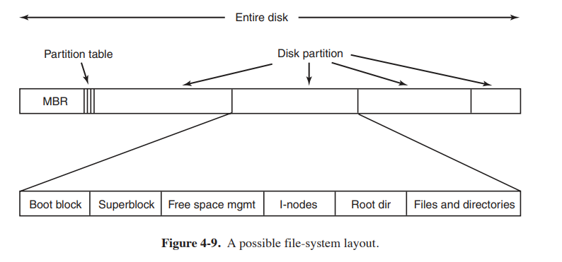

### 文件系统

定义：

A file system is a structure used by an operating system to organise and manage files on a storage device such as a hard drive, [solid state drive (SSD)](https://www.kingston.com/en/blog/pc-performance/benefits-of-ssd), or [USB flash drive](https://www.kingston.com/en/usb-flash-drives/usb-30). It defines how data is stored, accessed, and organised on the storage device. Different file systems have varying characteristics and are often specific to certain operating systems or devices. Here are some of the common file systems and their pros and cons.

#### 文件定义：

A file is an abstraction mechanism. It provides a way to store information on the disk and read it back later. This must be done in such a way as to shield the user from the details of how and where the information is stored, and how the disks actually work.

#### 文件类型：

Regular files are the ones that contain user information. All the files of Fig. 4-2 are regular files. Directories are system files for maintaining the structure of the file system. We will study directories below. Character special files are related to input/output and used to model serial I/O devices, such as terminals, printers, and networks. Block special files are used to model disks. In this chapter we will be primarily interested in regular files.

Fat32:

Memory cards, USB drives, and external hard drives that need wide compatibility use the FAT32 file system. It is compatible with all versions of Windows, Mac, Linux, gaming consoles, and other devices with a USB port. Individual files on a FAT32 system have a maximum size of 4 GB and a maximum partition of 2 TB. Any drive with a size greater than 2 TB will require multiple FAT32 partitions on the drive. FAT32 drives are best used when you need maximum compatibility and have file sizes smaller than 4 GB that are needed to play on various devices.

- [Understanding file systems- Kingston Technology](https://www.kingston.com/en/blog/personal-storage/understanding-file-systems)