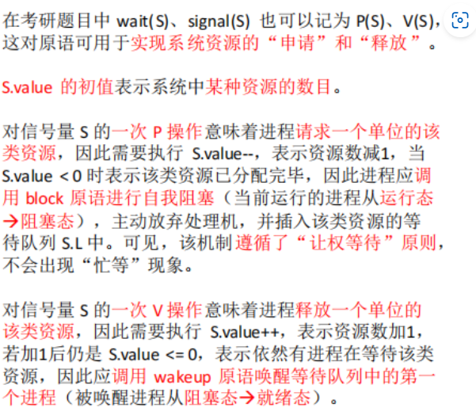
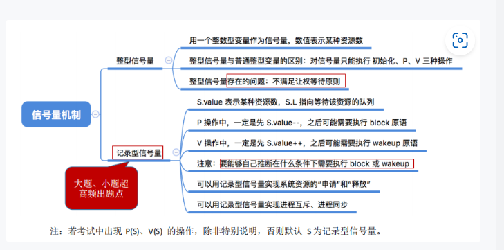

信号量（Semaphore）其实就是一个变量，它可以记录系统中某个资源的数量，而原语指的是 `wait(S)` 原语和 `signal(S)` 原语（或者说是 P 操作和 V 操作），可以看作是两个函数。

### [线程间的同步的方式有哪些？](#线程间的同步的方式有哪些)

线程同步是两个或多个共享关键资源的线程的并发执行。应该同步线程以避免关键的资源使用冲突。

下面是几种常见的线程同步的方式：

1. **互斥锁(Mutex)**：采用互斥对象机制，只有拥有互斥对象的线程才有访问公共资源的权限。因为互斥对象只有一个，所以可以保证公共资源不会被多个线程同时访问。比如 Java 中的 `synchronized` 关键词和各种 `Lock` 都是这种机制。
2. **读写锁（Read-Write Lock）**：允许多个线程同时读取共享资源，但只有一个线程可以对共享资源进行写操作。
3. **信号量(Semaphore)**：它允许同一时刻多个线程访问同一资源，但是需要控制同一时刻访问此资源的最大线程数量。
4. **屏障（Barrier）**：屏障是一种同步原语，用于等待多个线程到达某个点再一起继续执行。当一个线程到达屏障时，它会停止执行并等待其他线程到达屏障，直到所有线程都到达屏障后，它们才会一起继续执行。比如 Java 中的 `CyclicBarrier` 是这种机制。
5. **事件(Event)** :Wait/Notify：通过通知操作的方式来保持多线程同步，还可以方便的实现多线程优先级的比较操作。

------

### 死锁

死锁（Deadlock）描述的是这样一种情况：多个进程/线程同时被阻塞，它们中的一个或者全部都在等待某个资源被释放。由于进程/线程被无限期地阻塞，因此程序不可能正常终止。

解决死锁的方法可以从多个角度去分析，一般的情况下，有**预防，避免，检测和解除四种**。

- **预防** 是采用某种策略，**限制并发进程对资源的请求**，从而使得死锁的必要条件在系统执行的任何时间上都不满足。
- **避免**则是系统在分配资源时，根据资源的使用情况**提前做出预测**，从而**避免死锁的发生**
- **检测**是指系统设有**专门的机构**，当死锁发生时，该机构能够检测死锁的发生，并精确地确定与死锁有关的进程和资源。
- **解除** 是与检测相配套的一种措施，用于**将进程从死锁状态下解脱出来**。

死锁四大必要条件上面都已经列出来了，很显然，只要破坏四个必要条件中的任何一个就能够预防死锁的发生。

破坏第一个条件 **互斥条件**：使得资源是可以同时访问的，这是种简单的方法，磁盘就可以用这种方法管理，但是我们要知道，有很多资源 **往往是不能同时访问的** ，所以这种做法在大多数的场合是行不通的。

破坏第三个条件 **非抢占**：也就是说可以采用 **剥夺式调度算法**，但剥夺式调度方法目前一般仅适用于 **主存资源** 和 **处理器资源** 的分配，并不适用于所有的资源，会导致 **资源利用率下降**。

所以一般比较实用的 **预防死锁的方法**，是通过考虑破坏第二个条件和第四个条件。

死锁四大必要条件上面都已经列出来了，很显然，只要破坏四个必要条件中的任何一个就能够预防死锁的发生。

破坏第一个条件 **互斥条件**：使得资源是可以同时访问的，这是种简单的方法，磁盘就可以用这种方法管理，但是我们要知道，有很多资源 **往往是不能同时访问的** ，所以这种做法在大多数的场合是行不通的。

破坏第三个条件 **非抢占**：也就是说可以采用 **剥夺式调度算法**，但剥夺式调度方法目前一般仅适用于 **主存资源** 和 **处理器资源** 的分配，并不适用于所有的资源，会导致 **资源利用率下降**。

所以一般比较实用的 **预防死锁的方法**，是通过考虑破坏第二个条件和第四个条件。

------

[Focus on FE learning (chorer.github.io)](https://chorer.github.io/2020/03/25/OS-操作系统学习笔记-5：进程同步与进程互斥（二）：信号量机制/)

[操作系统——信号量机制及其实现进程互斥、同步、前驱关系 - 王陸 - 博客园 (cnblogs.com)](https://www.cnblogs.com/wkfvawl/p/11520301.html)

https://javaguide.cn/cs-basics/operating-system/operating-system-basic-questions-01.html