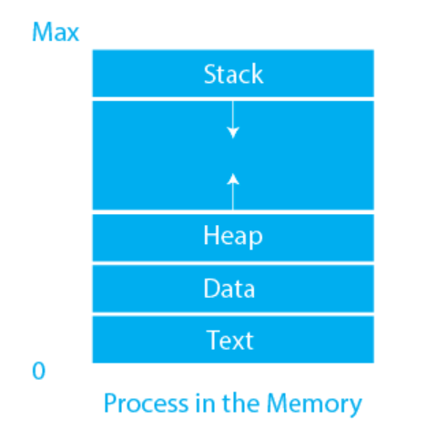
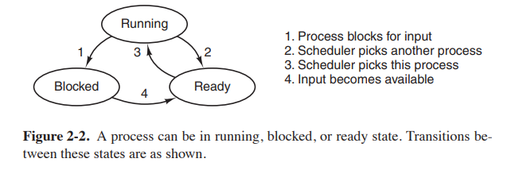
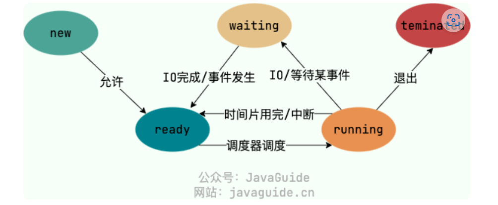
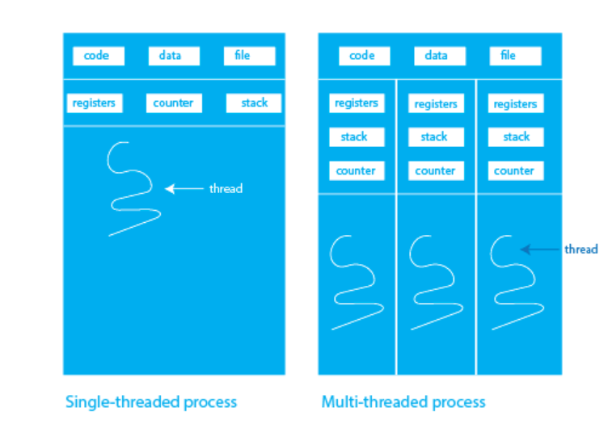
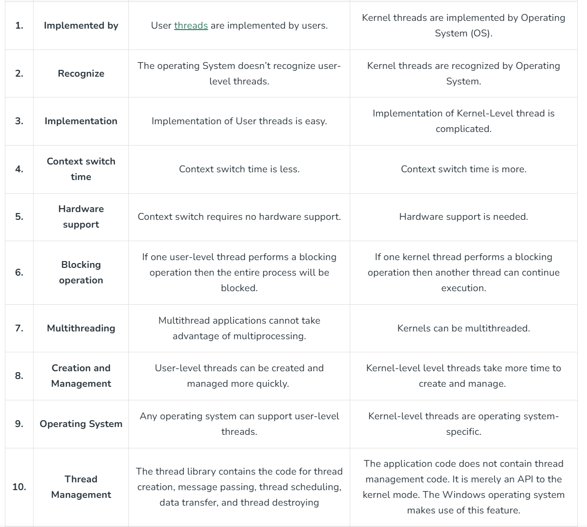
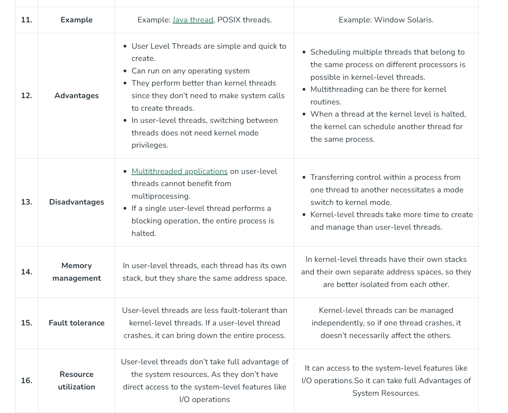

## 进程和线程

### 进程定义：

进程（英语：process），是指计算机中已执行的程序，曾经是分时系统的基本运作单位。在面向进程设计的系统（如早期的UNIX，Linux 2.4及更早的版本）中，是程序的基本执行实体；在面向线程设计的系统（如当代多数操作系统、Linux 2.6及更新的版本）中，进程本身不是基本执行单位，而是线程的容器。

In computing, a process is the instance of a computer program that is being executed by one or many threads. There are many different process models, some of which are light weight, but almost all processes (even entire virtual machines) are rooted in an operating system (OS) process which comprises the program code, assigned system resources, physical and logical access permissions, and data structures to initiate, control and coordinate execution activity. Depending on the OS, a process may be made up of multiple threads of execution that execute instructions concurrently.

- 包含一个或多个线程
- 包含代码，分配系统资源，管理访问权限
- 初始化，控制和协调执行活动

#### 进程的组成

In general, a computer system process consists of (or is said to own) the following resources:

- An image of the executable machine code associated with a program.
- Memory (typically some region of virtual memory); which includes the executable code, process-specific data (input and output), a call stack (to keep track of active subroutines and/or other events), and a heap to hold intermediate computation data generated during run time.
- Operating system descriptors of resources that are allocated to the process, such as file descriptors (Unix terminology) or handles (Windows), and data sources and sinks.
- Security attributes, such as the process owner and the process' set of permissions (allowable operations).
- Processor state (context), such as the content of registers and physical memory addressing. The state is typically stored in computer registers when the process is executing, and in memory otherwise.[1]

#### Process State

现代操作系统第四版的介绍：

网上博客的介绍：

我们一般把进程大致分为 5 种状态，这一点和线程很像！

- **创建状态(new)**：进程正在被创建，尚未到就绪状态。
- **就绪状态(ready)**：进程已处于准备运行状态，即进程获得了除了处理器之外的一切所需资源，一旦得到处理器资源(处理器分配的时间片)即可运行。
- **运行状态(running)**：进程正在处理器上运行(单核 CPU 下任意时刻只有一个进程处于运行状态)。
- **阻塞状态(waiting)**：又称为等待状态，进程正在等待某一事件而暂停运行如等待某资源为可用或等待 IO 操作完成。即使处理器空闲，该进程也不能运行。
- **结束状态(terminated)**：进程正在从系统中消失。可能是进程正常结束或其他原因中断退出运行。

####  [什么是僵尸进程和孤儿进程？](#什么是僵尸进程和孤儿进程)

在 Unix/Linux 系统中，子进程通常是通过 fork()系统调用创建的，该调用会创建一个新的进程，该进程是原有进程的一个副本。子进程和父进程的运行是相互独立的，它们各自拥有自己的 PCB，即使父进程结束了，子进程仍然可以继续运行。

当一个进程调用 exit()系统调用结束自己的生命时，内核会释放该进程的所有资源，包括打开的文件、占用的内存等，但是该进程对应的 PCB 依然存在于系统中。这些信息只有在父进程调用 wait()或 waitpid()系统调用时才会被释放，以便让父进程得到子进程的状态信息。

这样的设计可以让父进程在子进程结束时得到子进程的状态信息，并且可以防止出现“僵尸进程”（即子进程结束后 PCB 仍然存在但父进程无法得到状态信息的情况）。

- **僵尸进程**：子进程已经终止，但是其父进程仍在运行，且父进程没有调用 wait()或 waitpid()等系统调用来获取子进程的状态信息，释放子进程占用的资源，导致子进程的 PCB 依然存在于系统中，但无法被进一步使用。这种情况下，子进程被称为“僵尸进程”。避免僵尸进程的产生，父进程需要及时调用 wait()或 waitpid()系统调用来回收子进程。
- **孤儿进程**：一个进程的父进程已经终止或者不存在，但是该进程仍在运行。这种情况下，该进程就是孤儿进程。孤儿进程通常是由于父进程意外终止或未及时调用 wait()或 waitpid()等系统调用来回收子进程导致的。为了避免孤儿进程占用系统资源，操作系统会将孤儿进程的父进程设置为 init 进程（进程号为 1），由 init 进程来回收孤儿进程的资源。

***

### 线程定义：

In computer science, a thread of execution is the smallest sequence of programmed instructions that can be managed independently by a scheduler, which is typically a part of the operating system. In many cases, a thread is a component of a process.

#### 为什么有了进程还需要线程呢？

进程负责资源管理 + 执行。如果把这两个部分分离，可以有更好的性能。线程主要负责执行。

- Threads run in parallel improving the application performance. Each such thread has its own CPU state and stack, but they share the address space of the process and the environment. 
- Threads can share common data so they do not need to use inter-process communication. Like the processes, threads also have states like ready, executing, blocked, etc. 
- Priority can be assigned to the threads just like the process, and the highest priority thread is scheduled first.
- Each thread has its own Thread Control Block (TCB). Like the process, a context switch occurs for the thread, and register contents are saved in (TCB). As threads share the same address space and resources, synchronization is also required for the various activities of the thread.

Linux 内核选择线程作为调度单位主要是为了提高系统的并行性和效率。线程作为比进程更轻量级的调度单元，能够更好地利用多核处理器，提高系统性能，同时减少上下文切换的开销和资源管理的复杂性。这使得多线程编程成为实现高性能并发程序的有效方式。

#### User-Level Thread和Kernel Thread的差别

User Level Threads: 用户态编程框架自己定义，同一个kernel thread起的user thread在内核调度的视角中是不可见的。切换User Thread时，由于不需要kernel trap，因而上下文切换开销小。

#### 进程和程序的区别

程序本身只是指令、数据及其组织形式的描述，相当于一个名词，进程才是程序（那些指令和数据）的真正执行实例，可以想像说是现在进行式。若干进程有可能与同一个程序相关系，且每个进程皆可以同步（循序）或异步（平行）的方式独立执行。现代计算机系统可在同一段时间内以进程的形式将多个程序加载到存储器中，并借由时间共享（或称时分复用），以在一个处理器上表现出同时（平行性）执行的感觉。

While a computer program is a passive collection of instructions typically stored in a file on disk, a process is the execution of those instructions after being loaded from the disk into memory. 

#### 进程切换和线程切换的区别：

进程切换涉及到对虚拟地址空间的切换。

## Reference: 

- https://zh.wikipedia.org/wiki/%E8%A1%8C%E7%A8%8B
- https://www.prepbytes.com/blog/operating-system/difference-between-process-and-thread/
- [process - What are the relations between processes, kernel threads, lightweight processes and user threads in Unix? - Unix & Linux Stack Exchange](https://unix.stackexchange.com/questions/472324/what-are-the-relations-between-processes-kernel-threads-lightweight-processes)
- [task_struct简要分析 (kerneltravel.net)](https://www.kerneltravel.net/blog/2020/task_struct_zjqing/)
- [Difference between User Level thread and Kernel Level thread - GeeksforGeeks](https://www.geeksforgeeks.org/difference-between-user-level-thread-and-kernel-level-thread/)